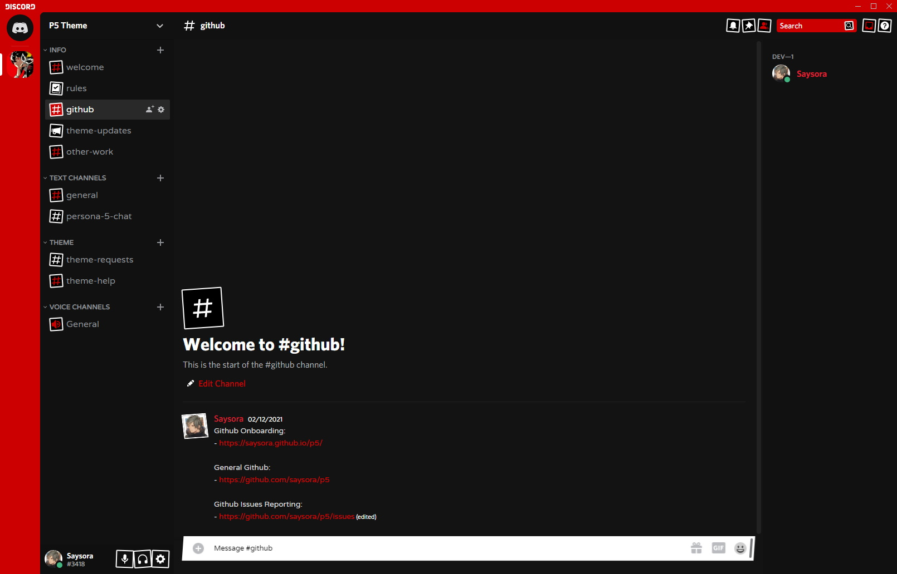

# Persona 5 Better Discord theme

## P5 Theme DISCORD

I think, for the sake of helping people troubleshoot and or feature updates regarding the theme, that having a discord server will be easier than needing to friend request me and dm. So a discord has been made.

## Black Cat Tavern Community Discord

> An active friendly discord community focused on video games and fantasy.

[Join](https://discord.gg/83uXScnuHm)

## Features

- Darker UI
- Persona 5 Color Scheme
- Persona fonts for inputs and message areas.
- Skewed Inputs for that Persona 5 Feel

### Installation

Download the P5.theme.css and put it in your better discord themes folder.
Typically located at /USERNAME/AppData/Roaming/betterdiscord/themes/

### Upcoming Features

- New Icons
- More Color Variation
- Inputs / Buttons with P5 Design

### Credits

Atlus obviously for Persona

_Date fonts_ is p5hatty credited to HattyMikune and ToxicDevil from Youtube
_Message fonts_ is PersonifiedUX credited to MV33izawsm

#### Questions

Feel free to open an issue here on github if you're having trouble with the theme. You can also contact me through the discord.
