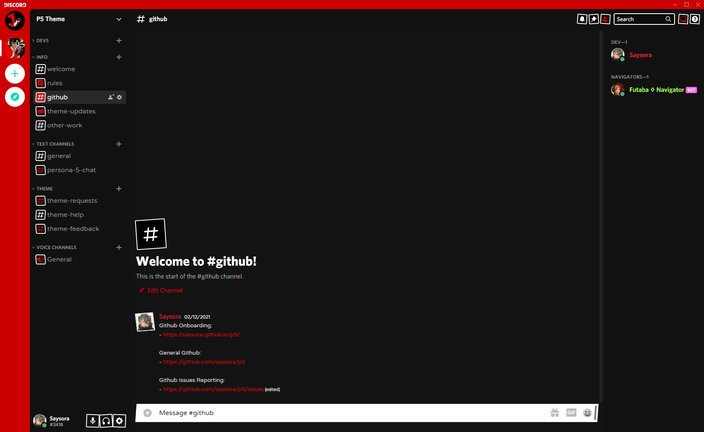

# Persona 5 Better Discord theme

## P5 Theme DISCORD

I think it's gonna be easier to help people for issues or other needs to join a discord rather than friending + dming so now there's a dedicated Discord specifically to this theme.

<iframe src="https://discord.com/widget?id=809893441139507250&theme=dark" width="350" height="500" allowtransparency="true" frameborder="0" sandbox="allow-popups allow-popups-to-escape-sandbox allow-same-origin allow-scripts"></iframe>

## Features

- Darker UI
- Persona 5 Color Scheme
- Persona fonts for inputs and message areas.
- Skewed Inputs for that Persona 5 Feel

### Installation

Download the P5.theme.css and put it in your better discord themes folder.
Typically located at /USERNAME/AppData/Roaming/betterdiscord/themes/

### Upcoming Features

- New Icons
- More Color Variation
- Inputs / Buttons with P5 Design

### Credits

Atlus obviously for Persona

_Date fonts_ is p5hatty credited to HattyMikune and ToxicDevil from Youtube
_Message fonts_ is PersonifiedUX credited to MV33izawsm

#### Questions

Feel free to open an issue here on github if you're having trouble with the theme. You can also contact me through dsicord at Saysora#3418
